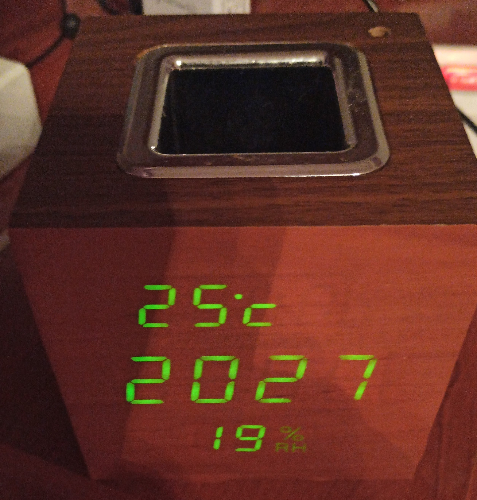
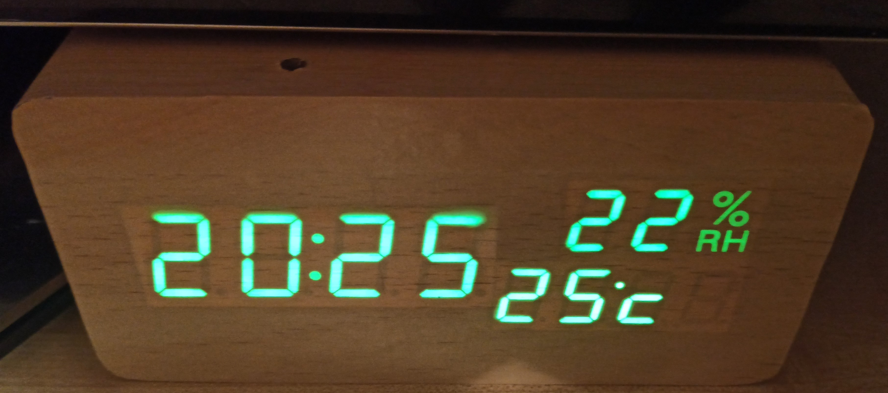
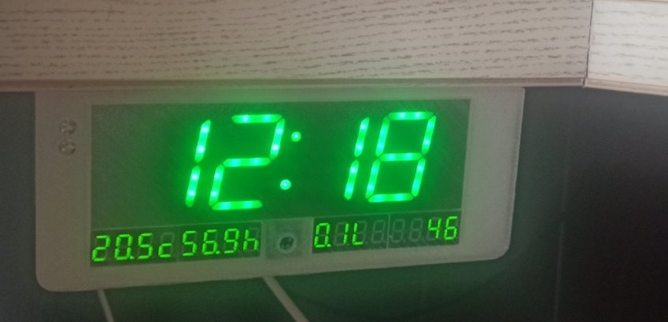
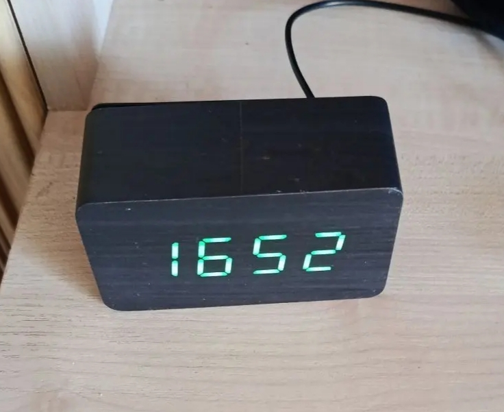

# ⏰ Умные часы с автоматической синхроизацией времени

[![License][license-shield]][license]
[![ESPHome release][esphome-release-shield]][esphome-release]

[license-shield]: https://img.shields.io/static/v1?label=License&message=MIT&color=orange&logo=license
[license]: https://opensource.org/licenses/MIT
[esphome-release-shield]: https://img.shields.io/static/v1?label=ESPHome&message=2026.6&color=green&logo=esphome
[esphome-release]: https://GitHub.com/esphome/esphome/releases/

**Семейство умных часов** с синхронизацией времени, автоматической регулировкой яркости и расширенным функционалом — от датчиков до интернет-радио.

---

## 📸 Фотогалерея

| Версия 1 | Версия 2 | Версия 3 | Версия 4 |
|----------|----------|----------|----------|
|  |  |  |  |

---

## 🎯 Концепция

> **Всё в одном устройстве.**  
> Избавляемся от множества отдельных датчиков — все функции объединены в элегантных настольных часах.

Китайские готовые часы часто имеют дисплеи, установленные "вверх ногами" — в наших проектах эта проблема решена.

---

## 📦 Версии

### 🔵 Версия 1
**Базовые часы + датчики + радио**

- ⏰ Синхронизация времени (NTP)
- ☀️ Автоматическая регулировка яркости
- 🌡️ Температура и влажность
- 💨 Качество воздуха
- 🌅 Положение солнца над горизонтом
- 📻 Интернет-радио 

**Дисплей:** 2 × TM1637 (7-сегментные, общий анод)  
*Особенность:* 5-й и 6-й разряды используются для индикации влажности

---

### 🟢 Версия 2
**Часы + климат-контроль**

- ⏰ Синхронизация времени (NTP)
- ☀️ Автоматическая регулировка яркости
- 🌡️ Температура и влажность
- 🏠 Температура пола
- 📊 PZEM AC (мониторинг энергопотребления)
- 📡 ИК-пульт (управление ТВ)
- 🌡️ Атмосферное давление
- 🌅 Положение солнца над горизонтом

**Дисплей:** 3 × TM1637 (7-сегментные, общий анод)  
*Особенность:* 3-й разряд и DP 3-го модуля отображают значок влажности

---

### 🟡 Версия 3
**Часы для кухни**

- ⏰ Синхронизация времени (NTP)
- ☀️ Автоматическая регулировка яркости
- 🌡️ Температура и влажность
- 🏠 Температура пола
- 💧 Расход и температура фильтрованной воды
- 📡 ИК-пульт (управление ТВ)

**Дисплей:** 3 × MAX7219 (общий катод)  
*Особенность:* 7-сегментные индикаторы времени собраны из отдельных светодиодов в корпусе от старых часов VST

🔧 **Монтаж:** под кухонный гарнитур (3D-модель корпуса в папке `clock-3`)

⚠️ **Важно:** Питание на каждый модуль MAX7219 подключать **параллельно** напрямую от ESP, особенно "+" — последовательное подключение приводит к разной яркости!

---

### 🟣 Версия 4
**Минималистичные часы**

- ⏰ Синхронизация времени (NTP)

**Дисплей:** 1 × TM1637 (7-сегментный, 4-разрядный)

---

## ⏰ Будильник

Реализован с использованием компонента [`dynamic_on_time`](https://github.com/hostcc/esphome-component-dynamic-on-time) и аппаратной части:
- 🎵 DF-Player (MP3-плеер)
- 🌡️ BME-680 (температура, влажность, давление, качество воздуха)

📄 Конфигурация: [`smart-time.yaml`](./smart-time.yaml)

---

### Часы с перелистыванием цифр
Эффектная анимация смены цифр на дисплеях MAX7219.

📄 Конфигурация: [`max7219.yaml`](./max7219.yaml)

---

⚠️ **Важно:** Пин **D8** на Wemos D1 mini не использовать для подключения TM1637 и MAX7219!

---

## 🏠 Интеграция с Home Assistant

Для точной синхронизации времени рекомендуется установить аддон **Chrony**:

---

## 📄 Лицензия

Распространяется под лицензией **MIT** — свободно используйте, модифицируйте и вдохновляйтесь!

---

## ⭐ Поддержать проект

Если проект оказался полезным — поставьте ⭐ на GitHub!
